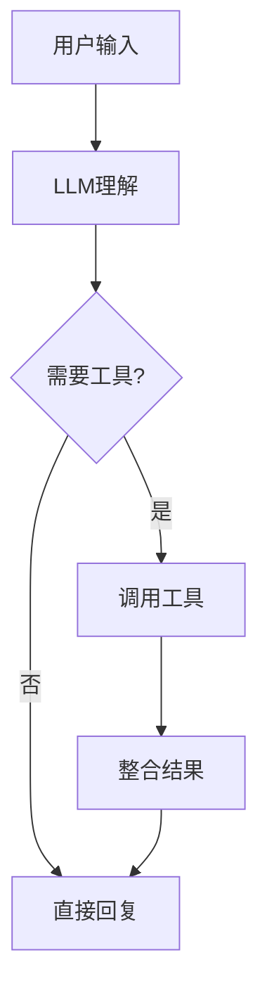

# CSDN Blog Publisher

Automate the complete workflow of researching, writing, and publishing technical blogs to CSDN.

## Workflow Overview

```
┌─────────────────────────────────────────────────────────────────┐
│                    CSDN Blog Publishing Workflow                  │
├─────────────────────────────────────────────────────────────────┤
│  1. Research     │  2. Write Draft  │  3. Add Diagrams          │
│  (web_fetch)     │  (Markdown)      │  (ASCII/Mermaid/Images)   │
├──────────────────┴──────────────────┴───────────────────────────┤
│  4. Open CSDN Editor  │  5. Upload Cover  │  6. Publish         │
│  (browser)            │  (from article)   │  (configure & post) │
└─────────────────────────────────────────────────────────────────┘
```

## Series Article Support

### Title Format for Series
```
【{系列名}篇】{序号}：{主标题}

Examples:
【Agents篇】01：AI Agent 的崛起：从概念到实践的全面解析
【Agents篇】02：Agent 的大脑：LLM 作为核心控制器
【VLMs篇】01：视觉语言模型入门
```

### Series Planning Template
```markdown
# {系列名} 专栏规划

## 系列目标
让读者看完后能够...

## 文章列表
| # | 标题 | 核心内容 | 状态 |
|---|------|----------|------|
| 01 | ... | ... | ✅/📝 |
```

## Step 1: Research Content

### For Paper-based Articles

1. **Find Paper on arXiv/GitHub**
```python
# Fetch paper content
web_fetch(url="https://arxiv.org/abs/2309.07864", maxChars=50000)
```

2. **Extract Key Information**
- Abstract & Contributions
- Methodology / Architecture
- Experiments & Results
- Figures (note figure numbers for later)

3. **Recommended Paper Sources**
```python
PAPER_SOURCES = {
    "agent": "https://github.com/WooooDyy/LLM-Agent-Paper-List",
    "llm": "https://github.com/Hannibal046/Awesome-LLM",
    "multimodal": "https://github.com/BradyFU/Awesome-Multimodal-Large-Language-Models",
}
```

### For Survey Articles

Use authoritative sources:
- arXiv papers
- Official documentation
- GitHub repositories with 1k+ stars

## Step 2: Write Blog Draft

### Article Structure
```markdown
# 【{系列}篇】{序号}：{标题}

> 一句话摘要，吸引读者

## 📑 文章目录
- [一. 引言](#一-引言)
- [二. 核心概念](#二-核心概念)
...

---

## 一. 引言 🌅
### 1.1 背景与动机
为什么需要这个技术...

### 1.2 本文内容
本文将介绍...

---

## 二. 核心概念 🏗️
### 2.1 概念A
详细解释...

> 💡 **思考**：为什么需要这样设计？
> 
> 🤔 这是因为...

### 2.2 概念B
...

---

## 三. 技术细节 🔧
### 3.1 算法流程
```
步骤1 → 步骤2 → 步骤3
```

### 3.2 代码实现
```python
# 示例代码
```

---

## 四. 实验与案例 🌟
### 4.1 实验设置
...

### 4.2 结果分析
| 方法 | 指标A | 指标B |
|------|-------|-------|
| ... | ... | ... |

---

## 五. 总结与展望 🚀
- 核心要点总结
- 未来发展方向

---

## 参考文献
[1] Author et al. "Paper Title". Venue, Year. [paper](url)
[2] ...
```

### Writing Guidelines

1. **技术深度与通俗并重**
   - 先解释"是什么"和"为什么"
   - 再深入"怎么做"
   - 用类比帮助理解复杂概念

2. **图文并茂**
   - 每个核心概念配图
   - ASCII 架构图清晰展示结构
   - 使用论文原图并标注来源

3. **互动元素**
   - 💡 思考题引导读者思考
   - 🤔 解答提供深度见解
   - 📊 表格对比不同方案

4. **字数要求**
   - 综述类：15,000-20,000 字
   - 技术解析：8,000-15,000 字
   - 实战教程：5,000-10,000 字

## Step 3: Add Diagrams

### ASCII Diagrams
```
┌─────────────────────────────────────────────────┐
│                    Agent 架构                     │
├─────────────────────────────────────────────────┤
│  ┌─────────┐    ┌─────────┐    ┌─────────┐     │
│  │   感知   │ → │   大脑   │ → │   行动   │     │
│  │Perception│    │  Brain  │    │  Action │     │
│  └─────────┘    └─────────┘    └─────────┘     │
│                      ↑↓                          │
│                 ┌─────────┐                      │
│                 │   记忆   │                      │
│                 │  Memory │                      │
│                 └─────────┘                      │
└─────────────────────────────────────────────────┘
```

### Paper Figures

1. **Find figure URL from arXiv**
```
https://arxiv.org/html/{paper_id}/figure1.png
or
https://github.com/{repo}/blob/main/assets/figure1.jpg
```

2. **Insert in Markdown**
```markdown

*图片来源：[论文名称], 作者*
```

3. **Download for Cover**
```bash
curl -o cover.jpg "https://raw.githubusercontent.com/repo/main/assets/figure.jpg"
```

### Mermaid Diagrams (if CSDN supports)


## Step 4: Open CSDN Editor

```python
# Navigate to CSDN Markdown editor
browser(action="open", profile="openclaw", targetUrl="https://editor.csdn.net/md?not_checkout=1")

# Wait for editor to load
browser(action="snapshot")

# Find import button and import content
browser(action="act", request={"kind": "click", "ref": "<import-button-ref>"})
```

## Step 5: Configure & Upload Cover

### Cover Image Selection Priority

1. **Best**: 使用文章中最精美的技术图/架构图
2. **Good**: 论文中的关键 Figure
3. **Fallback**: Pixabay 免费图片

### Upload Process

```python
# 1. Click "添加封面" or upload button
browser(action="snapshot", interactive=True)
browser(action="act", request={"kind": "click", "ref": "<add-cover-ref>"})

# 2. Upload image file
browser(action="upload", paths=["/path/to/cover.jpg"])

# 3. Confirm in crop dialog (Vue image cropper)
browser(action="act", request={
    "kind": "evaluate",
    "fn": "(function(){ var btn = document.querySelector('.vicp-operate-btn'); if(btn) { btn.click(); return 'clicked'; } return 'not found'; })()"
})
```

## Step 6: Publish Article

### Configure Settings

| Setting | Value |
|---------|-------|
| 文章标签 | 人工智能, LLM, Agent (按需) |
| 文章类型 | 原创 |
| 可见范围 | 全部可见 |
| 分类专栏 | 选择或创建专栏（如"Agents"）|
| 文章摘要 | 点击"AI提取摘要"或手写 |

### Publish Steps

```python
# 1. Click publish button
browser(action="act", request={"kind": "click", "ref": "<publish-btn>"})

# 2. Wait for dialog, configure settings
browser(action="snapshot")

# 3. Add tags, select column, etc.
# 4. Click final publish
browser(action="act", request={"kind": "click", "ref": "<final-publish>"})
```

### Success Indicators
- ✅ Green checkmark appears
- ✅ URL changes to article page
- ✅ Shows "发布成功" or article preview

## Column Management

### Create New Column
```python
# In publish dialog, click "新建专栏"
# Set column name: "Agents"
# Set column description
```

### Set Article as Top (置顶)
```python
# Go to: https://mp.csdn.net/mp_blog/manage/article
# Find article, click "..." menu
# Select "置顶"
```

## Common Issues

| Issue | Solution |
|-------|----------|
| Image upload stuck | Use JavaScript: `.vicp-operate-btn` click |
| Can't find button | Take fresh snapshot, search by text |
| Tags not working | Click input first, type tag, press Enter |
| Article too long | CSDN has no limit, but chunk edits if browser slow |

## Output Checklist

- [ ] Draft saved to workspace (`{title}_Blog.md`)
- [ ] Article published to CSDN
- [ ] Cover image uploaded (from article content)
- [ ] Tags configured
- [ ] Added to correct column (专栏)
- [ ] Article URL obtained
- [ ] Memory file updated

## Resources

- [references/blog-format.md](references/blog-format.md) - Detailed formatting guide
- [assets/blog-template.md](assets/blog-template.md) - Starter template
- [references/series-plan-template.md](references/series-plan-template.md) - Series planning template

---

*Updated: 2026-02-02 - Added series support, paper figure workflow, improved publishing steps*
